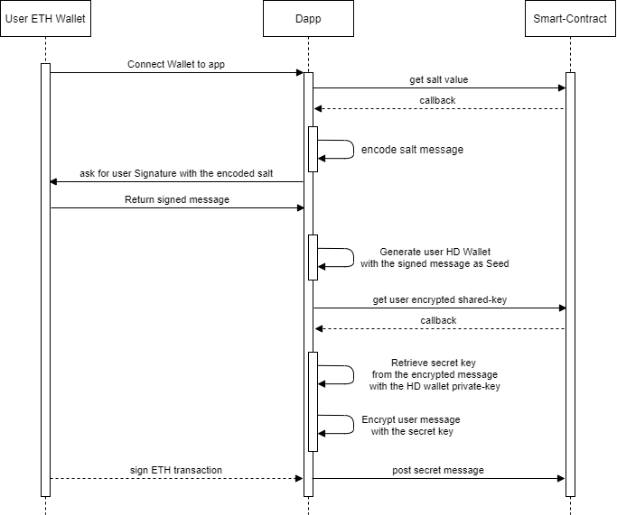

# Blockchain key-vault to store and protect your secrets 🔏

This project showcases a truly decentralized data vault on Ethereum.

All the packages required for launching the project can be installed in each `packages` repository divided in two:

- Buidler: Containing all the smart-contract logic and its tests.

- frontend/react_vault: Containing the React front-end and its IPFS deployer.


## How it works?

Due to the inability of the Metamask extension to expose the user private key wallet, we built this project with the ability to use a derived Ethereum Keypair generated with the signature of the user main wallet through hierarchical deterministic wallets.

Each vault has a public salt value; This value is used for users to generate an HD wallet and is added during the deployment of the vault contract, as a random 128 bits value.

The HD wallet used for encrypting/decrypting messages is generated with a signed message of the public vault salt used as a seed. The HD wallet is generated by following the [BIP-32](https://github.com/bitcoin/bips/blob/master/bip-0032.mediawiki) standard, with a seed of 512 bits used from the user signature.

Once the wallet is generated, a private and public key can be derived and used in a secured manner locally.


Another secret key is used on the contract, but the latter is never visible; it is saved inside an encrypted message that can only be revealed with the associated private-key derived from the seed. If a user is whitelisted inside the vault, he can retrieve the encrypted secret key, and decrypt it off-chain with their derived private-key to then interact with the vault and append new secrets.

The first owner of the vault can add new users by encrypted the secret key with the public-key of users who share to the owner their derived public-key. These new users must connect to the vault, even if they're not allowed, in order to get the correct derived public-key generated by their Metamask wallet.

#### Dapp workflow for posting a secret message





### Encryption/Decryption details

For the encrypting/decrypting of the secret messages, the project uses AES-256-CBC with the [crypto-js library](https://github.com/brix/crypto-js).

However, for the encryption/decryption of the shared secret-key, we use the ECIES encryption scheme with multiple encryptions algorithms in combination; secp256k1 elliptic curve for the public-key calculations, SHA-512 for the key derivation function (KDF), HMAC-SHA-256 for the MAC algorithm and AES-256-CBC for the symmetric cypher. All of this is handled thanks to the [eccrypto library](https://github.com/bitchan/eccrypto).

Thus, when posting the encrypted shared secret key inside the smart-contract, the payload has to be parsed properly to fit inside a single `string` arguments:

```typescript
const stringifiedPayload = Buffer.concat([
                encryptedObject.iv,
                encryptedObject.ephemPublicKey,
                encryptedObject.ciphertext,
                encryptedObject.mac,
]).toString('hex');
```

The `stringifiedPayload` that we send to the smart-contract is a concatenated *Buffer* with all the encryption data.

Thus, when we retrieve the same payload from the smart-contract to decrypt it, we need to properly parse it to retrieve all the ECIES encryption fields:

```typescript
const parsedPayload = {
                iv: Buffer.from(buffer_.toString('hex', 0, 16), 'hex'),
                ephemPublicKey: Buffer.from(buffer_.toString('hex', 16, 81), 'hex'),
                ciphertext: Buffer.from(buffer_.toString('hex', 81, buffer_.length - 32), 'hex'),
                mac: Buffer.from(buffer_.toString('hex', buffer_.length - 32, buffer_.length), 'hex')
};
```

The Initialization Vector (IV) is the first 16 bytes of data of the payload. The ephemeral Public-key is the next 65 bytes of data, and the MAC is the last 32 bytes of the data Buffer. For the ciphertext, as it is variable, we extract it in between the fixed size of the `ephemPublicKey` and `mac` variables.

Once these values are properly retrieved, we can decrypt the message and decrypt the secret key with the user derived Private-key.


## How to install?

### Smart-contracts

The contracts are built with solidity 0.6.0.
The tests on the other hand are built on Buidler with the ethers plugin in TypeScript.

Go inside the Buidler folder, and get the proper node version:

```
nvm use
```

Afterwards, install the dependencies:

```
npm install
```

Then, generate the typechains:

```
npm run build
```

and you can then test and deploy the contracts:

```
npm run test
npx buidler run --network rinkeby scripts/deploy.ts
```

### Front-end

The front-end is built with create-react-app with TypeScript support.

To run the project, set the proper node version and install all the dependencies:

```
nvm use
yarn install
```

And then add the `./artifacts` folder from the buidler one to the `./src` of the React project to allow ethers to properly interact on Ethereum.
You can also update the `initialFactoryAddress` variable inside `.App.tsx`, to change the KeyVaultFactory to interact with if you use a different network.
By default, it is set on a KeyVaultFactory on Ropsten.

Once this is done, you can launch the project:

```
yarn start
```

To deploy the front on IPFS, simply run:

```
yarn run ipfs
```

## Demo
The demo is currently available here on Ropsten network: https://bafybeibsswgdp2wkjqrj4wemiozrl7gd2ebuyaajri54yl75u7w367kqhu.ipfs.infura-ipfs.io/
